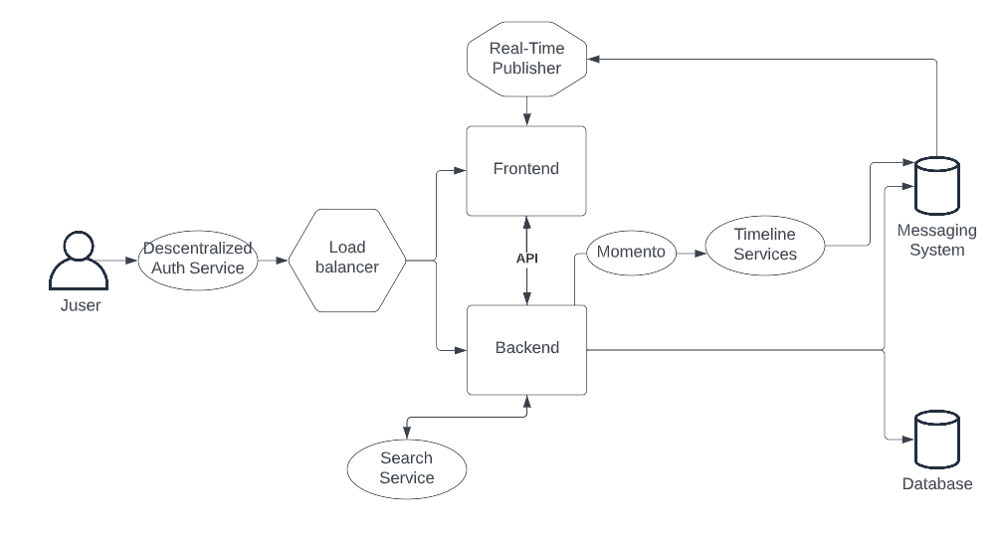
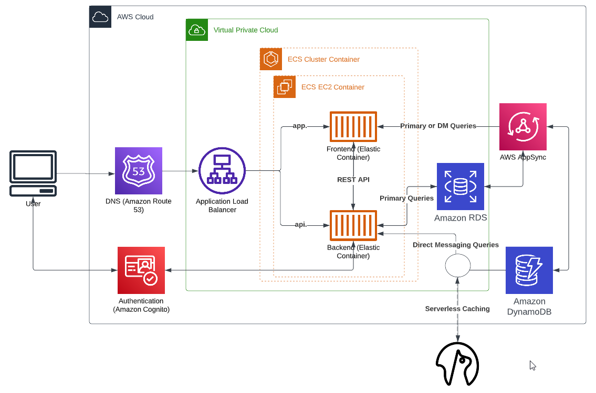

# Week 0 — Billing and Architecture

**Freestyle notes**

Installed all technologies pre-requisites.
Bought domain via Route 53.
My heart jumped when I saw all my budgets and alarms showing Exceeding Limit, until I've remembered it's because of the domain I bought. The mystery continued for a bit as the $$ bill still wasn't what I expected - of course! I've got the default hosted zone that gets assigned to the domain, so had to remove that.

Took me a bit to figure out I need to install the Gitpod browser extension to see the Gitpod button in Github and avoid using gitpod.io/#.

I've done most tasks via the CLI first, for example I've created a billing alarm via AWS browser interface after creating from the CLI so I had an SNS already. 

Enabled MFA everywhere :) and started using IAM user for most things.

Had to give IAM user permissions for billing access so IAM user can see budgets - https://docs.aws.amazon.com/IAM/latest/UserGuide/tutorial_billing.html?icmpid=docs_iam_console#tutorial-billing-step1.

Had to enable cost center so I can select more than one budget type (i.e. Cost budget - Recommended) for the Customize (advanced) budget setup.

Wanted to understand the various types of costs - https://aws.amazon.com/blogs/aws-cloud-financial-management/understanding-your-aws-cost-datasets-a-cheat-sheet/ - unblended sounded like the one to choose for my context.

Cost allocation tags - there were none in my account - was not covered how to create them - I have no resources created either which would require tagging. 

AWS Cost Management reports are useful. Same for [AWS Pricing Calculator](https://calculator.aws/#/) (remember it caculates relative to 730 hours).

Created various other tags while following through the Security video and creating an AWS Organisation, Service Control Policies. I had to enable Organization SCP which resulted in only FullAWSAccess policy being listed (different from video content).

Enabled AWS CloudTrail - must monitor this for any expense risk.

Created the conceptual and logic diagrams - https://lucid.app/lucidchart/44e11662-de4e-4635-a880-eb94402eba0d/edit?invitationId=inv_8a7147b0-5264-43e2-a3d7-6f8af639e2a0&page=0_0#

# Step by Step

## AWS Users

* Created AWS account > root user
* Created IAM user and added it to an Admin group with AdministratorAccess policy
* Created an Access Key for this user so it can be used to set up AWS CLI access

## AWS CLI

https://docs.aws.amazon.com/cli/latest/userguide/getting-started-install.html
* Want to have AWS CLI in the Gitpod environment when it launches
* Install the Gitpod browser extension, link your gitpod and github accounts
* Launch Gitpod from your Github (via the button)

Update .gitpod.yml to include the following task.

```
tasks:
  - name: aws-cli
    env:
      AWS_CLI_AUTO_PROMPT: on-partial
    init: |
      cd /workspace
      curl "https://awscli.amazonaws.com/awscli-exe-linux-x86_64.zip" -o "awscliv2.zip"
      unzip awscliv2.zip
      sudo ./aws/install
      cd $THEIA_WORKSPACE_ROOT
```
* Set up environment variables so you avoid using senstive data in plain text in scripts

```
gp env AWS_ACCESS_KEY_ID="add your key"
gp env AWS_SECRET_ACCESS_KEY="add your secret key"
gp env AWS_DEFAULT_REGION=us-east-1
```
* Check AWS CLI is working 

```
aws sts get-caller-identity
```

* Set AWS account details as env vars as well, if you are likely to use them in scripts

```
gp env AWS_ACCOUNT_ID="add your account id"
gp env AWS_EMAIL="add your email address"
```

## AWS Budgets and Billing

Note:
* the billing alarm represents only the amount you have been already charged
* the budget can alarm you based on forecasted charges
* you can have for free: 2 budgets, 10 alerts

> :warning: **Do not commit files with your account id, email address, arn values etc. to the repo.** Execute the files containing them, then remove sensitive data before committing.

Notes: 
* Looked for how to use json variables, but eventually abandoned the idea.
* I’ve set alert to 90% because I already have spent more than 80% of what I want to spend because I bought a Route 53 domain and registered it.

* Enable Billing from your root account [Billing page](https://console.aws.amazon.com/billing/) > Billing Preferences > Receive Billing Alerts > Save

* Create SNS topic that will handle delivery of the alert [reference](https://docs.aws.amazon.com/cli/latest/reference/sns/create-topic.html)

```
aws sns create-topic --name billing-alarm
```

* Create subscription

```
aws sns subscribe \
    --topic-arn TopicARN \
    --protocol email \
    --notification-endpoint your@email.com
```

* Check email and confirm subsription

* Create alarm - makes use of the subscription: the TopicARN. See example [here](https://aws.amazon.com/premiumsupport/knowledge-center/cloudwatch-estimatedcharges-alarm/):

```
aws cloudwatch put-metric-alarm --cli-input-json file://aws/json/alarm_config.json
```

* Create an AWS budget using your AWS account details [reference](https://docs.aws.amazon.com/cli/latest/reference/budgets/create-budget.html)

```
aws budgets create-budget \
    --account-id AccountID \
    --budget file://aws/json/budget.json \
    --notifications-with-subscribers file://aws/json/budget-notifications-with-subscribers.json
```

## AWS Organizations

* Usually needed in larger organisations
* You'd usually define Active_Accounts and Standby_Account and various Business_Units under those
* You can assign security policies to roles, groups, users

## AWS Well-Architected Framework

* Enabled it, tried it, tempted to tick all the boxes (except None of the above)

## AWS diagrams





## Various Command lines

* aws --cli-auto-prompt
* aws sts get-caller-identity
* aws account get-contact-information
* export AWS_ACCOUNT_ID=$(aws sts get-caller-identity --query Account --output text)


