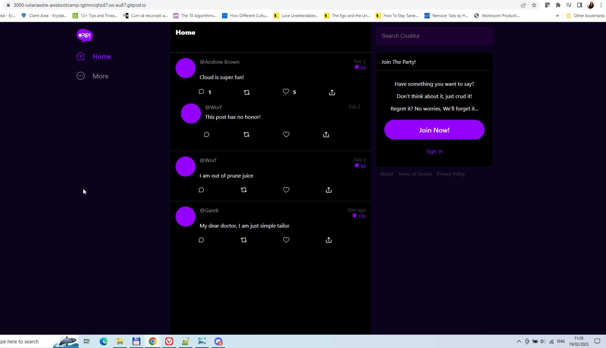
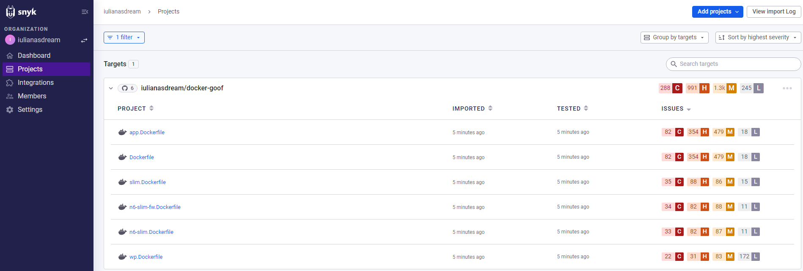
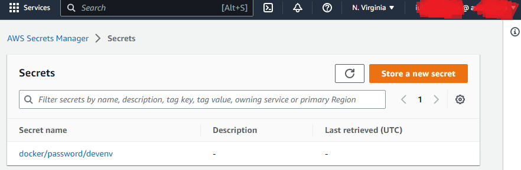

# Week 1 — App Containerization

# Required Homework

## Docker Live session

Attended live session and managed to keep up - didn’t understand why we had to manually add /api/activities/home to the URL to make the app work (Could that have been avoided? Unnecessary confusion)

Used docker commands to build and run containers, then Compose Up to run a micro-services version of the application i.e. with multiple images doing their thing. Reproduced this the morning after the class for screenshot, includes my change to “Cloud is **super** fun!”.

## Docker Security

Followed through the Security video.

* I’ve set up [SNYK](https://app.snyk.io/org/iulianasdream) on my github account for public repos.
* I’ve forked the [docker-goof](https://github.com/snyk-labs/docker-goof) repo to put it through snyk and saw the vulnerabilities

## AWS Secrets Manager

…so you don’t store secrets in docker files.

* Created an AWS secret

# Other notes

## Real-world

One of my employers used **JFROG** for internal artifacts and docker images registry. You could pull a docker image or an .rpm installer of the products they were developing. There was a public, customer, docker registry as well. 

I was the feature owner (and tester) for that employer’s first Docker solution for their core product and championed the process for automatic publishing of docker images to the public registry. Loved it!

## CloudTrail - Avoid expenses

* Implemented as part of the Security videos, but has risk of expenses increasing.
* Stopped CloudTrail logging and removed it.
* Emptied [S3 bucket](https://console.aws.amazon.com/s3/) and deleted it. Had to google how to do this, couldn't leave them hanging around although logging stopped and CloudTrail instance deleted.

## My docker cheatsheet