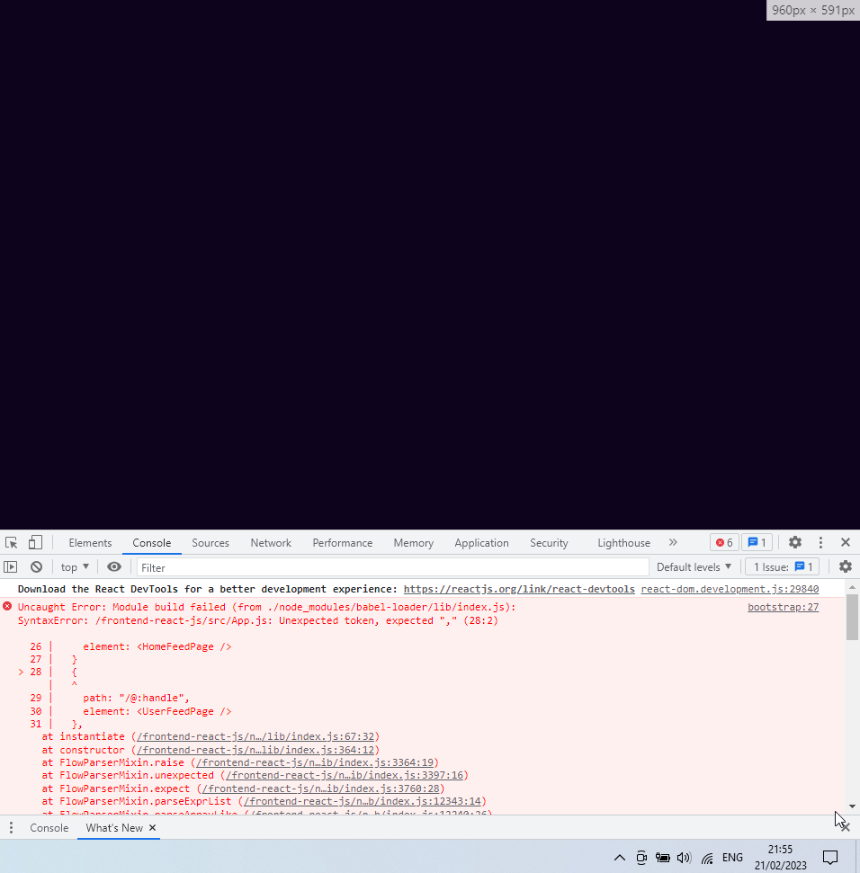
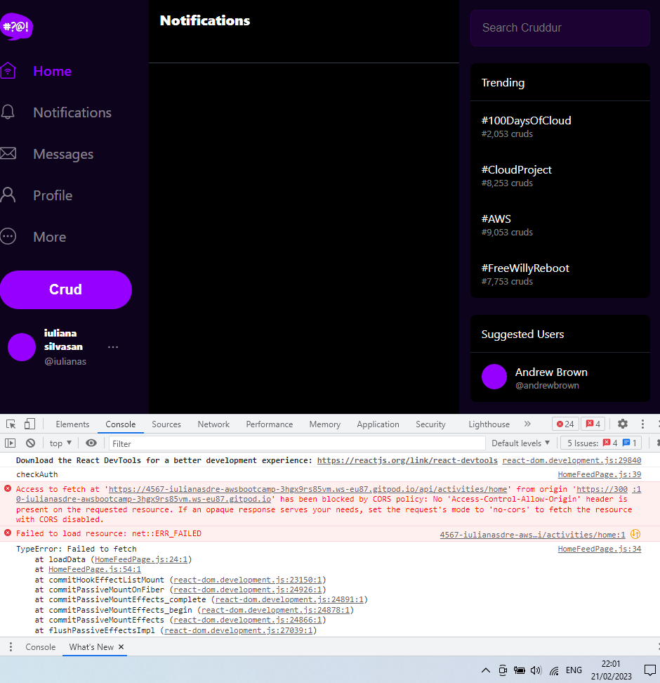
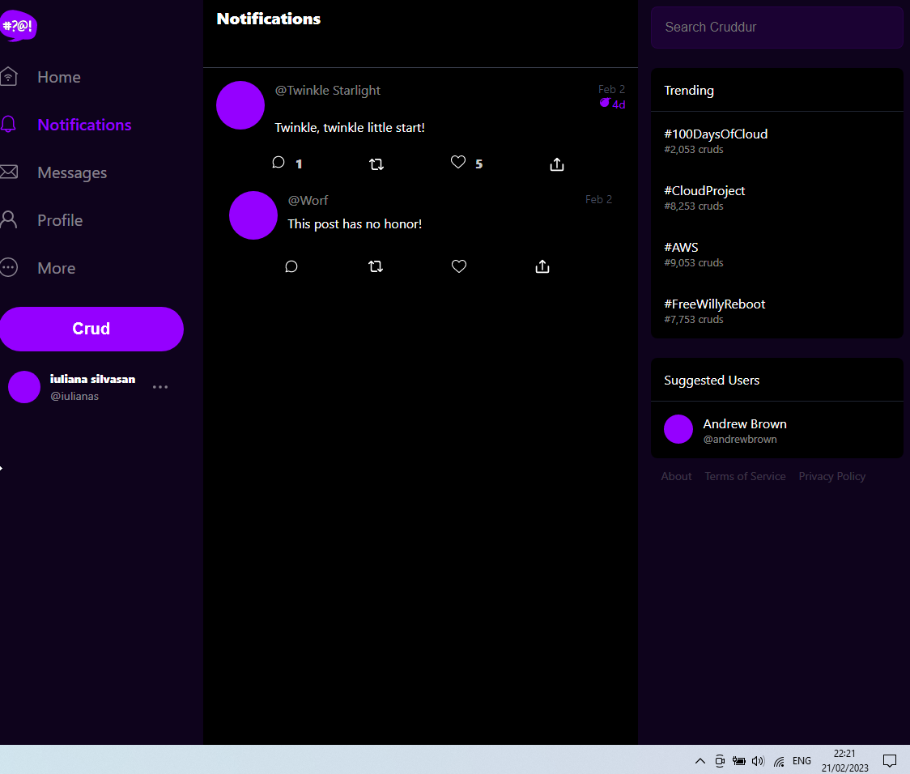
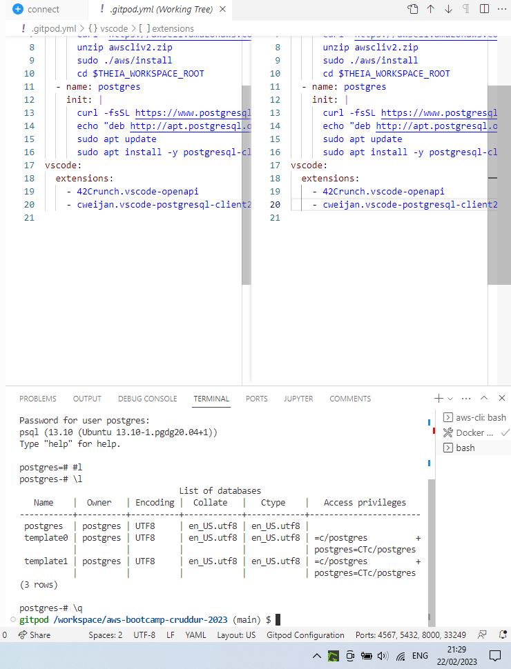
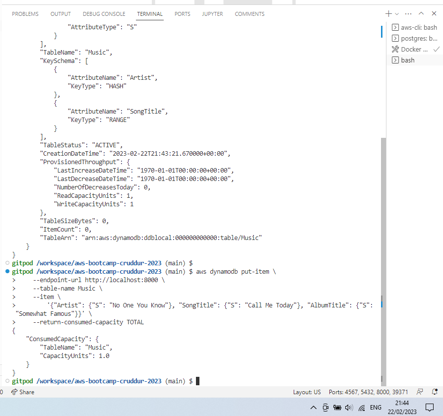

# Week 1 — App Containerization

# Required Homework

## Docker Live session

Attended live session and managed to keep up - didn’t understand why we had to manually add /api/activities/home to the URL to make the app work (Could that have been avoided? Unnecessary confusion)

Used docker commands to build and run containers, then Compose Up to run a micro-services version of the application i.e. with multiple images doing their thing. Reproduced this the morning after the class for screenshot, includes my change to “Cloud is **super** fun!”.


## Docker Security

Followed through the Security video.

* I’ve set up [SNYK](https://app.snyk.io/org/iulianasdream) on my github account for public repos.
* I’ve forked the [docker-goof](https://github.com/snyk-labs/docker-goof) repo to put it through snyk and saw the vulnerabilities


## AWS Secrets Manager

…so you don’t store secrets in docker files.

* Created an AWS secret


# Create the notification feature

Found out about [OpenAPI specification](https://www.openapis.org/) (used to be called swagger) and [https://readme.com](https://readme.com/) 

Checked the OpenAPI specification where you can learn about different objects, data types etc. 

Note for later: [Rails Service Objects](https://www.toptal.com/ruby-on-rails/rails-service-objects-tutorial) - the Rails services concept that supports micro-services deployments

Followed along the code for backend and frontend. Did some extra changes to the code for frontend: replaced all ‘home’ occurrences with ‘notifications’. The app wouldn’t load.



I really thought I copied that comma, I knew it’s needed. 🙂

Fixed that, but then actual Notifications and Home entries don’t load - CORS errors:



The problem was the ports were locked. All fine after unlocking ports.



Did the work in a branch and then merged it to main via Pull Request.

## DynamoDB Local and Postgres 

Useful links: [AWS DynamoDB Local](https://docs.aws.amazon.com/amazondynamodb/latest/developerguide/DynamoDBLocal.html) and [100DaysOfCloud](https://github.com/100DaysOfCloud/challenge-dynamodb-local)

Some struggle with psql client, but sorted via

```
psql -U postgres --host localhost
```



DynamoDB also working



# Stretch Homework

## Run the dockerfile CMD as an external script

Replaced CMD with ENTRYPOINT and put the commands in a .sh script executed by Entrypoint. Issues encountered.
* got "executable file not found in $PATH" errors
* port 3000, although open, was not served

Solutions
* ([ref1](https://github.com/docker-library/postgres/issues/296)) entrypoint failing to find file, so I’ve used /usr/bin/ as the destination in the container
- ([ref2](https://sebhastian.com/npm-start-not-working/)) port 3000 not working, so frontend not ok. NPM not starting? package.json is there, start script is mentioned. I can see npm install being run during docker compose up.
    - Add npm install to the [frontend.sh](http://frontend.sh) script executed by Entrypoint ⇒ port is now green, but browser displays port 3000 not found instead of the app
    - After a few compose up and down and waiting a bit on the page, I got the app page. **Yay!**

Other resources that helped:
*  [ref3 - run a script in dockerfile](https://stackoverflow.com/questions/34549859/run-a-script-in-dockerfile)
* RUN is used during the build phase to modify the Docker image, while CMD specifies the default command to run when a container is started from the image.
* ([ref4](https://stackoverflow.com/questions/56586562/how-to-source-an-entry-point-script-with-docker)) it is [not a good idea](https://blog.phusion.nl/2015/01/20/docker-and-the-pid-1-zombie-reaping-problem/) to run a shell as the initial process in a container. That screws up the signal handling. You'll notice that you cannot stop execution with Ctrl-C. Therefore, use `CMD` instead of `ENTRYPOINT` to start the shell. The initial process with id 1 should be a minimal init process, such as `[tini](https://stackoverflow.com/a/44689700/11451509)`.
 * well, I'm still runnin a .sh
- ([ref5- general intro to CMD and ENTRYPOINT](https://aws.amazon.com/blogs/opensource/demystifying-entrypoint-cmd-docker/))

# Other notes

## Real-world

One of my employers used **JFROG** for internal artifacts and docker images registry. You could pull a docker image or an .rpm installer of the products they were developing. There was a public, customer, docker registry as well. 

I was the feature owner (and tester) for that employer’s first Docker solution for their core product and championed the process for automatic publishing of docker images to the public registry. Loved it!

## CloudTrail - Avoid expenses

* Implemented as part of the Security videos, but has risk of expenses increasing.
* Stopped CloudTrail logging and removed it.
* Emptied [S3 bucket](https://console.aws.amazon.com/s3/) and deleted it. Had to google how to do this, couldn't leave them hanging around although logging stopped and CloudTrail instance deleted.

## My docker cheatsheet