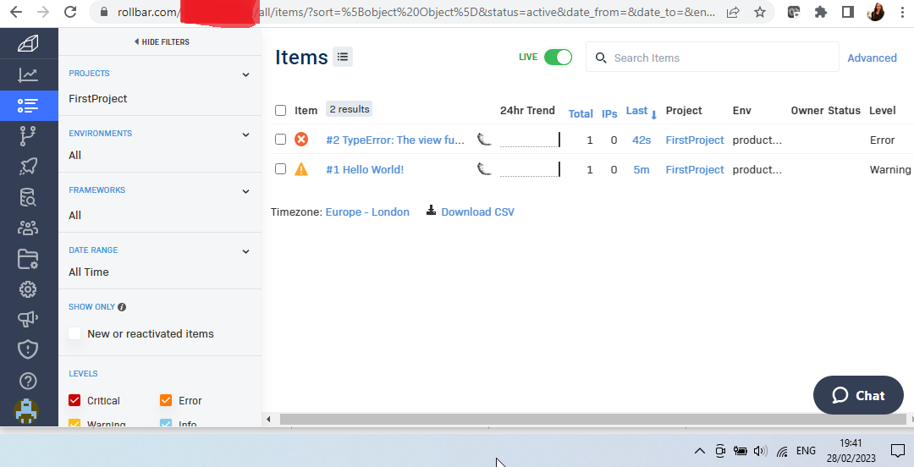
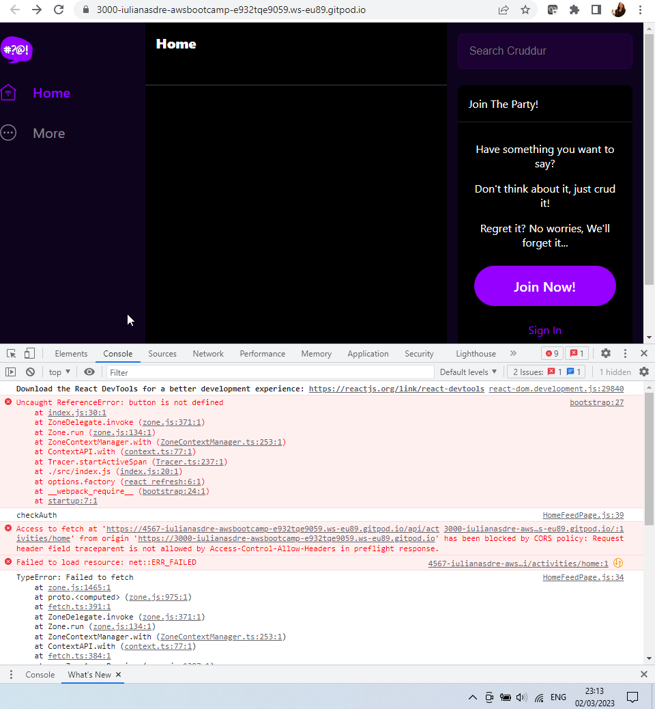

# Week 2 — Distributed Tracing

# Required Homework

## Live Video notes

**Issues**

- Not getting the data in Honeycomb bootcamp, just in Honeycomb test
- After a few docker compose down & up and closing Gitpod workspace and starting new ones and setting the env var HONEYCOMB_API_KEY again, I’ve got data in Honeycomb bootcamp space.

**Yaaaas!**


**Resources**

[https://www.youtube.com/watch?v=2GD9xCzRId4](https://www.youtube.com/watch?v=2GD9xCzRId4)

- Open Telemetry OTEL for observability [opentelemetry.io](http://opentelemetry.io) or [cncf.io](http://cncf.io) Cloud Native Computing Foundation

Observability

- My cloud sends standardized messages to honeycomb who stores them in databases for viewing and investigation
- No same dockerfile because you want different base images - one for development, one for production

Honeycomb

- Docs [https://docs.honeycomb.io/getting-data-in/opentelemetry/python/](https://docs.honeycomb.io/getting-data-in/opentelemetry/python/)
- Checking the honeycomb API key [https://honeycomb-whoami.glitch.me/](https://honeycomb-whoami.glitch.me/)

## Queries in Honeycomb

I’ve not done this bit during the live class, so when reproducing the class instruction I chose Last 24 hours for the data so I have something to see without stating up gitpod and running all the containers again. 


**Latency queries**

- look at duration
    - heatmap of duration is one of the best
    - want percentile as well: **p90** (90% of requests are faster than this number)


**Resources**

- [https://docs.honeycomb.io/working-with-your-data/query-examples/](https://docs.honeycomb.io/working-with-your-data/query-examples/)
- Querying metrics (i.e. the fields on events) [https://docs.honeycomb.io/working-with-your-data/metrics/](https://docs.honeycomb.io/working-with-your-data/metrics/) e.g. heatmap
    - Recommended that you combine `HEATMAP`  with other Visualize Operations to get a better sense of trends over time.
- Ideas for queries - what would we want to observe?
    - memory usage of a host
    - latency / site responsiveness
    - (Frontend) Performance: How long did it take for pages to load or render? How long did it take for remote requests to return? What page or piece of your application is slowest for users to see?
    - (Frontend) Reliability: Which functions succeeded or failed? Were there JavaScript errors? On which browser versions did those errors occur?
    - (Frontend) User journey: Which application functions are most used? What do users call most often? Are users able to accomplish their intended goals in your application?
    - (Frontend) Focus on a user *WHERE user_id = 2345678* or how long it takes for pages to render, with a query that tells you *P95(render_time) WHERE event=page-load*
    - (Frontend) How long pages stay open

## Instrument X-Ray

* Before starting, gitpod.yml solution proposed (below), but I’ve done it by adding npm install to the ENTRYPOINT in the dockerfile for frontend

```
- name: react-js
    command: |
     cd frontend-react-js
     npm i
```

Experience

* Instrumening X-Ray was successful, but flaky - took a few attempts to see the traces, although the group existed. 
* Hard to find X-Ray Traces in AWS due to new interface and Cloudwatch: 
 * Go to Settings from Cloudwatch page or try adding _#/service-map_ to the URL

AWS group created

```
aws xray create-group \
 --group-name "Cruddur" \
 --filter-expression "service(\"backend-flask\")"
```


aws-xray-daemon added and running - did not have a Bad Gateway error as Andrew did


**Resources**

- [https://www.youtube.com/watch?v=n2DTsuBrD_A](https://www.youtube.com/watch?v=n2DTsuBrD_A)
- [https://stackoverflow.com/questions/54236375/what-are-the-best-practises-for-setting-up-x-ray-daemon](https://stackoverflow.com/questions/54236375/what-are-the-best-practises-for-setting-up-x-ray-daemon)
- [https://docs.aws.amazon.com/index.html#sdks](https://docs.aws.amazon.com/index.html#sdks)
- [https://boto3.amazonaws.com/v1/documentation/api/latest/reference/services/xray.html](https://boto3.amazonaws.com/v1/documentation/api/latest/reference/services/xray.html)
- https://github.com/aws/aws-xray-sdk-python - getting some of our code from here
- https://docs.aws.amazon.com/xray-sdk-for-python/latest/reference/configurations.html 

Segment and Sub-segment for user_activities - requires adding to backend URL: "/api/activities/@<user>"


## Cloudwatch logs

They worked, but disabled them to avoid costs.


**Resources**

- [https://www.youtube.com/watch?v=n2DTsuBrD_A](https://www.youtube.com/watch?v=n2DTsuBrD_A)
- [https://pypi.org/project/watchtower/](https://pypi.org/project/watchtower/)

## Rollbar 

Rollbar setup worked



## Frontend Observability

Observe a user's client-side experience.

I’m not sure I’ll complete this challenge in time or at all 🙂, but I’ve worked on it, understood some of the concepts, got stuck in the code 🙂 - still only in branch **frontend-observability**:

* created **otel-collector-config.yml** in the main project folder

```
receivers:
 otlp:
  protocols:
   grpc: # port 4317
    endpoint: "0.0.0.0:4317"
   http: # port 4318
    endpoint: "0.0.0.0:4318"
    cors:
     allowed_origins:
      - "https://3000-${GITPOD_WORKSPACE_ID}.${GITPOD_WORKSPACE_CLUSTER_HOST}"
      - "https://4567-${GITPOD_WORKSPACE_ID}.${GITPOD_WORKSPACE_CLUSTER_HOST}"

processors:
 batch:
  timeout: 10s

exporters:
 otlp:
  endpoint: "api.honeycomb.io:443"
  headers:
   "x-honeycomb-team": "${HONEYCOMB_API_KEY}"
 otlp/metrics:
  endpoint: "api.honeycomb.io:443"
  headers:
   "x-honeycomb-team": "${HONEYCOMB_API_KEY}"
   "x-honeycomb-dataset": "frontend-react-js"

service:
 extensions: [health_check]
 pipelines:
  traces:
   receivers: [otlp]
   processors: [batch]
   exporters: [otlp]
  metrics:
   receivers: []
   processors: []
   exporters: [otlp/metrics]
```

* created **tracing.js** in frontend-react-js/src/

```jsx
import { WebTracerProvider } from '@opentelemetry/sdk-trace-web';
import { getWebAutoInstrumentations } from '@opentelemetry/auto-instrumentations-web';
import { OTLPTraceExporter } from '@opentelemetry/exporter-trace-otlp-http';
import { BatchSpanProcessor } from '@opentelemetry/sdk-trace-base';
import { registerInstrumentations } from '@opentelemetry/instrumentation';
import { ZoneContextManager } from '@opentelemetry/context-zone';
const { Resource } = require('@opentelemetry/resources');
const { SemanticResourceAttributes } = require('@opentelemetry/semantic-conventions');

const exporter = new OTLPTraceExporter({
  url: 'https://api.honeycomb.io:443:443/v1/traces'
});

const provider = new WebTracerProvider({
  resource: new Resource({
    [SemanticResourceAttributes.SERVICE_NAME]: 'browser',
  }),
});

provider.addSpanProcessor(new BatchSpanProcessor(exporter));
provider.register({
  contextManager: new ZoneContextManager()
});

registerInstrumentations({
  instrumentations: [
    getWebAutoInstrumentations({
      // load custom configuration for xml-http-request instrumentation
      '@opentelemetry/instrumentation-xml-http-request': {
        propagateTraceHeaderCorsUrls: [
            /.+/g, // regex to match your URL
          ],
      },
      // load custom configuration for fetch instrumentation
      '@opentelemetry/instrumentation-fetch': {
        propagateTraceHeaderCorsUrls: [
            /.+/g,
          ],
      },
    }),
  ],
 });
```

* updated my **frontend.sh** script used by the frontend Docker file (**ENTRYPOINT [ "/usr/bin/frontend.sh" ]**) to make sure it loads the OTEL libraries

```
#!/bin/bash
npm install --save \
    @opentelemetry/api \
    @opentelemetry/sdk-trace-web \
    @opentelemetry/exporter-trace-otlp-http \
    @opentelemetry/context-zone \
    @opentelemetry/auto-instrumentations-web \
    @opentelemetry/instrumentation \
    @opentelemetry/instrumentation-xml-http-request \
    @opentelemetry/instrumentation-fetch
npm start
```

* updated **index.js** with code for creating traces and spans. This is where the JS errors started 🙂



* I tried to use a button.clicked event, but I’ve not defined the button and then saw the app doesn’t have any buttons, so I added one to **frontend-react-js/components/JoinSection.js**

```
<button type="button" id="testButton">Click Me!</button> 
```

*-* That sorted, the next error was about button property clicked being null, so I then moved the button inside the code about the window loading to make sure all elements are loaded and available before I make any calls to them. Added some code for debugging to see the button works. So **index.js** ended up being:
    * P.S. code wants to start a trace and a span for window loading event and then then send another span when a button is clicked

```jsx
import './tracing.js'
import React from 'react';
import ReactDOM from 'react-dom/client';
import './index.css';
import App from './App';
import reportWebVitals from './reportWebVitals';

const el_main = document.getElementsByTagName('main')[0];
const root = ReactDOM.createRoot(el_main);
root.render(
  <React.StrictMode>
    <App />
  </React.StrictMode>
);

import { trace, context, } from '@opentelemetry/api';

const tracer = trace.getTracer();

const rootSpan = tracer.startActiveSpan('document_load', span => {
  //start span when navigating to page
  span.setAttribute('pageUrlwindow', window.location.href);
  window.onload = (event) => {
    // ... do loading things
    alert("Your page is loaded");
    // ... attach timing information
    //var loadTime = window.performance.timing.domContentLoadedEventEnd- window.performance.timing.navigationStart;
    span.end(); //once page is loaded, end the span

    var button = document.getElementById("testButton");
    function colorFunction() {
      window.alert("This color is blue!");
    }
    button.onclick=colorFunction;

    button.clicked = (event) => {
      tracer.startActiveSpan('app.button_clicked', btnSpan => {
        // Add your attributes to describe the button clicked here
        btnSpan.setAttribute('app.attr.signup', 'app.val.clicked');

        btnSpan.end();
      });
    }
  };
});

// If you want to start measuring performance in your app, pass a function
// to log results (for example: reportWebVitals(console.log))
// or send to an analytics endpoint. Learn more: https://bit.ly/CRA-vitals
reportWebVitals();
```

* Now the only error remaining is about CORS and the fact the frontend is sending a **traceparent** header that is not allowed. I’ve stopped here for now.

I’ve also tried to run runnig the OTEL Collector docker image in Gitpod while the other containers from my docker-compose were running.

```
docker pull otel/opentelemetry-collector:0.71.0
docker run otel/opentelemetry-collector:0.71.0
```

But that didn’t work, hence why I switched focus to the frontend code:

```
gitpod /workspace/aws-bootcamp-cruddur-2023 (frontend-observability) $ docker run otel/opentelemetry-collector:0.71.0
Error: failed to get config: cannot unmarshal the configuration: 1 error(s) decoding:

* error decoding 'exporters': error reading configuration for "logging": 1 error(s) decoding:

* '' has invalid keys: logLevel
2023/03/02 22:55:32 collector server run finished with error: failed to get config: cannot unmarshal the configuration: 1 error(s) decoding:

* error decoding 'exporters': error reading configuration for "logging": 1 error(s) decoding:

* '' has invalid keys: logLevel
```

Also tried:

```
docker run -v $(pwd)/otel-collector-config.yml:/etc/otelcol/config.yaml otel/opentelemetry-collector:0.71.0
```

But that wasn't any better:

```
Error: invalid configuration: service::pipeline::metrics: must have at least one receiver
2023/03/04 09:15:49 collector server run finished with error: invalid configuration: service::pipeline::metrics: must have at least one receiver
```

Stopping here for now.

**Resources**

- [https://www.honeycomb.io/wp-content/uploads/2022/03/Front-end-Observability-Whitepaper-1.pdf](https://www.honeycomb.io/wp-content/uploads/2022/03/Front-end-Observability-Whitepaper-1.pdf)
    - [https://docs.honeycomb.io/getting-data-in/otel-collector/](https://docs.honeycomb.io/getting-data-in/otel-collector/)
    - [https://opentelemetry.io/docs/collector/getting-started/](https://opentelemetry.io/docs/collector/getting-started/)
        - https://github.com/open-telemetry/opentelemetry-collector-contrib
            - clone someone else’s repo
    - how to clone otel github in gitpod [https://www.gitpod.io/docs/configure/workspaces/multi-repo](https://www.gitpod.io/docs/configure/workspaces/multi-repo)
    - [https://signoz.io/blog/opentelemetry-architecture/](https://signoz.io/blog/opentelemetry-architecture/)
    - [https://docs.honeycomb.io/getting-data-in/opentelemetry/browser-js/](https://docs.honeycomb.io/getting-data-in/opentelemetry/browser-js/)
    - [https://opentelemetry.io/docs/instrumentation/js/instrumentation/](https://opentelemetry.io/docs/instrumentation/js/instrumentation/)
    - [https://www.honeycomb.io/blog/opentelemetry-browser-instrumentation](https://www.honeycomb.io/blog/opentelemetry-browser-instrumentation)
    - [https://github.com/open-telemetry/opentelemetry-collector/blob/main/examples/k8s/otel-config.yaml](https://github.com/open-telemetry/opentelemetry-collector/blob/main/examples/k8s/otel-config.yaml)
    - [https://stackoverflow.com/questions/14341156/calculating-page-load-time-in-javascript](https://stackoverflow.com/questions/14341156/calculating-page-load-time-in-javascript)
    - [https://stackoverflow.com/questions/9778888/uncaught-typeerror-cannot-set-property-onclick-of-null](https://stackoverflow.com/questions/9778888/uncaught-typeerror-cannot-set-property-onclick-of-null)
    - A trace represents a user’s interactions on a single page.
        - Use the first event (page load) as the start of your trace and
        connect that first event to additional spans to build a full trace of the user session. Each span will represent a single thing that you want to track, such as a server request or a user click.
        - [https://opentelemetry.io/docs/instrumentation/js/](https://opentelemetry.io/docs/instrumentation/js/) Open Telemetry for Javascript
        - Currently, OpenTelemetry browser traces are sent as OTLP (OpenTelemetry Line Protocol) via HTTP/JSON. As of the time of this writing, Honeycomb directly accepts OTLP only via HTTP/protobuf or GRPC/protobuf. That means you will need an OpenTelemetry Collector to accept your browser traces before sending them to Honeycomb.
            - store your Honeycomb API credentials within the collector
            - [https://signoz.io/blog/opentelemetry-architecture/](https://signoz.io/blog/opentelemetry-architecture/)
            - https://github.com/open-telemetry/opentelemetry-collector
            - [https://www.youtube.com/watch?v=RaK9ocku-M4](https://www.youtube.com/watch?v=RaK9ocku-M4) and [https://www.youtube.com/watch?v=EeU-k659lpw](https://www.youtube.com/watch?v=EeU-k659lpw) and [https://www.youtube.com/watch?v=bsVyry8U47Q](https://www.youtube.com/watch?v=bsVyry8U47Q)
    - For your application, you will pick a set of DOM events to instrument. When those happen, your browser app will send back events to report on these actions e.g. page rendering, user
    clicks and interactions, and page transitions.
    - When to send an event:
        - On page load. When the browser does a hard page load or navigation, this is a good time to send an event that includes Navigation Timing API data, Resource Timing data, and any attributes of the browser itself that you are curious about (screen size, user agent, capabilities).
        - Once per SPA navigation
        - Once per significant user action
    - What to capture in an event (generate events with high dimensionality):
        - The page state—what page the browser is on, what it is doing at the moment, what unit
        of work is occurring right now, which control raised it, and which arguments were passed.
        - The duration to process the event, along with any errors or failures that occurred on
        the way.
        - The browser version and any relevant settings.
        - The version of your application code and any relevant flags or settings.
- For some types of applications—especially single-page apps (SPAs) and other JavaScript-intensive cases—instrumenting server requests alone won’t show you how users interact with the app or the responsiveness of the client-side code. Users can initiate many complex interactions with browser apps that never generate a request to the server.
- RUM Real User Monitoring
    - In most cases, JavaScript snippets are injected into the page or native code within the application to provide feedback from the browser or client.
- Synthetic Monitoring is a different approach that relies on automated tests going over a given
set of test steps in order to take measurements.

