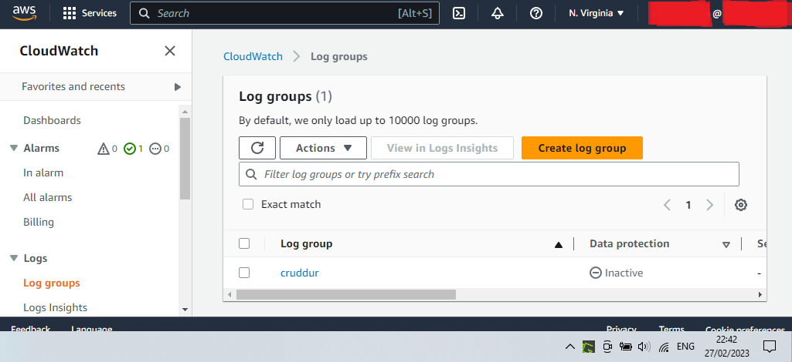

# Week 2 — Distributed Tracing

# Required Homework

## Live Video notes

**Issues**

- Not getting the data in Honeycomb bootcamp, just in Honeycomb test
- After a few docker compose down & up and closing Gitpod workspace and starting new ones and setting the env var HONEYCOMB_API_KEY again, I’ve got data in Honeycomb bootcamp space.

**Yaaaas!**


**Resources**

[https://www.youtube.com/watch?v=2GD9xCzRId4](https://www.youtube.com/watch?v=2GD9xCzRId4)

- Open Telemetry OTEL for observability [opentelemetry.io](http://opentelemetry.io) or [cncf.io](http://cncf.io) Cloud Native Computing Foundation

Observability

- My cloud sends standardized messages to honeycomb who stores them in databases for viewing and investigation
- No same dockerfile because you want different base images - one for development, one for production

Honeycomb

- Docs [https://docs.honeycomb.io/getting-data-in/opentelemetry/python/](https://docs.honeycomb.io/getting-data-in/opentelemetry/python/)
- Checking the honeycomb API key [https://honeycomb-whoami.glitch.me/](https://honeycomb-whoami.glitch.me/)

## Queries in Honeycomb

I’ve not done this bit during the live class, so when reproducing the class instruction I chose Last 24 hours for the data so I have something to see without stating up gitpod and running all the containers again. 


**Latency queries**

- look at duration
    - heatmap of duration is one of the best
    - want percentile as well: **p90** (90% of requests are faster than this number)


**Resources**

- [https://docs.honeycomb.io/working-with-your-data/query-examples/](https://docs.honeycomb.io/working-with-your-data/query-examples/)
- Querying metrics (i.e. the fields on events) [https://docs.honeycomb.io/working-with-your-data/metrics/](https://docs.honeycomb.io/working-with-your-data/metrics/) e.g. heatmap
    - Recommended that you combine `HEATMAP`  with other Visualize Operations to get a better sense of trends over time.
- Ideas for queries - what would we want to observe?
    - memory usage of a host
    - latency / site responsiveness
    - (Frontend) Performance: How long did it take for pages to load or render? How long did it take for remote requests to return? What page or piece of your application is slowest for users to see?
    - (Frontend) Reliability: Which functions succeeded or failed? Were there JavaScript errors? On which browser versions did those errors occur?
    - (Frontend) User journey: Which application functions are most used? What do users call most often? Are users able to accomplish their intended goals in your application?
    - (Frontend) Focus on a user *WHERE user_id = 2345678* or how long it takes for pages to render, with a query that tells you *P95(render_time) WHERE event=page-load*
    - (Frontend) How long pages stay open

## Instrument X-Ray

* Before starting, gitpod.yml solution proposed (below), but I’ve done it by adding npm install to the ENTRYPOINT in the dockerfile for frontend

```
- name: react-js
    command: |
     cd frontend-react-js
     npm i
```

Experience

* Instrumening X-Ray was successful, but flaky - took a few attempts to see the traces, although the group existed. 
* Hard to find X-Ray Traces in AWS due to new interface and Cloudwatch: 
 * Go to Settings from Cloudwatch page or try adding _#/service-map_ to the URL

AWS group created

```
aws xray create-group \
 --group-name "Cruddur" \
 --filter-expression "service(\"backend-flask\")"
```


aws-xray-daemon added and running - did not have a Bad Gateway error as Andrew did


**Resources**

- [https://www.youtube.com/watch?v=n2DTsuBrD_A](https://www.youtube.com/watch?v=n2DTsuBrD_A)
- [https://stackoverflow.com/questions/54236375/what-are-the-best-practises-for-setting-up-x-ray-daemon](https://stackoverflow.com/questions/54236375/what-are-the-best-practises-for-setting-up-x-ray-daemon)
- [https://docs.aws.amazon.com/index.html#sdks](https://docs.aws.amazon.com/index.html#sdks)
- [https://boto3.amazonaws.com/v1/documentation/api/latest/reference/services/xray.html](https://boto3.amazonaws.com/v1/documentation/api/latest/reference/services/xray.html)
- https://github.com/aws/aws-xray-sdk-python - getting some of our code from here
- https://docs.aws.amazon.com/xray-sdk-for-python/latest/reference/configurations.html 

Segment and Sub-segment for user_activities - requires adding to backend URL: "/api/activities/@<user>"


## Cloudwatch logs

They worked, but disabled them to avoid costs.




**Resources**

- [https://www.youtube.com/watch?v=n2DTsuBrD_A](https://www.youtube.com/watch?v=n2DTsuBrD_A)
- [https://pypi.org/project/watchtower/](https://pypi.org/project/watchtower/)

## Frontend Observability

Observe a user's client-side experience.

**Resources**

- [https://www.honeycomb.io/wp-content/uploads/2022/03/Front-end-Observability-Whitepaper-1.pdf](https://www.honeycomb.io/wp-content/uploads/2022/03/Front-end-Observability-Whitepaper-1.pdf)
    - [https://docs.honeycomb.io/getting-data-in/otel-collector/](https://docs.honeycomb.io/getting-data-in/otel-collector/)
    - [https://opentelemetry.io/docs/collector/getting-started/](https://opentelemetry.io/docs/collector/getting-started/)
        - https://github.com/open-telemetry/opentelemetry-collector-contrib
            - clone someone else’s repo
    - how to clone otel github in gitpod [https://www.gitpod.io/docs/configure/workspaces/multi-repo](https://www.gitpod.io/docs/configure/workspaces/multi-repo)
    - [https://signoz.io/blog/opentelemetry-architecture/](https://signoz.io/blog/opentelemetry-architecture/)
    - A trace represents a user’s interactions on a single page.
        - Use the first event (page load) as the start of your trace and connect that first event to additional spans to build a full trace of the user session. Each span will represent a single thing that you want to track, such as a server request or a user click.
        - [https://opentelemetry.io/docs/instrumentation/js/](https://opentelemetry.io/docs/instrumentation/js/) Open Telemetry for Javascript
        - Currently, OpenTelemetry browser traces are sent as OTLP (OpenTelemetry Line Protocol) via HTTP/JSON. Honeycomb directly accepts OTLP only via HTTP/protobuf or GRPC/protobuf. That means you will need an OpenTelemetry Collector to accept your browser traces before sending them to Honeycomb.
            - store your Honeycomb API credentials within the collector
            - [https://signoz.io/blog/opentelemetry-architecture/](https://signoz.io/blog/opentelemetry-architecture/)
            - https://github.com/open-telemetry/opentelemetry-collector
            - [https://www.youtube.com/watch?v=RaK9ocku-M4](https://www.youtube.com/watch?v=RaK9ocku-M4) and [https://www.youtube.com/watch?v=EeU-k659lpw](https://www.youtube.com/watch?v=EeU-k659lpw) and [https://www.youtube.com/watch?v=bsVyry8U47Q](https://www.youtube.com/watch?v=bsVyry8U47Q)
    - For your application, you will pick a set of DOM events to instrument. When those happen, your browser app will send back events to report on these actions e.g. page rendering, user clicks and interactions, and page transitions.
    - When to send an event:
        - On page load. When the browser does a hard page load or navigation, this is a good time to send an event that includes Navigation Timing API data, Resource Timing data, and any attributes of the browser itself that you are curious about (screen size, user agent, capabilities).
        - Once per SPA navigation
        - Once per significant user action
    - What to capture in an event (generate events with high dimensionality):
        - The page state—what page the browser is on, what it is doing at the moment, what unit of work is occurring right now, which control raised it, and which arguments were passed.
        - The duration to process the event, along with any errors or failures that occurred on         the way.
        - The browser version and any relevant settings.
        - The version of your application code and any relevant flags or settings.
- For some types of applications—especially single-page apps (SPAs) and other JavaScript-intensive cases—instrumenting server requests alone won’t show you how users interact with the app or the responsiveness of the client-side code. Users can initiate many complex interactions with browser apps that never generate a request to the server.
- RUM Real User Monitoring
    - In most cases, JavaScript snippets are injected into the page or native code within the application to provide feedback from the browser or client.
- Synthetic Monitoring is a different approach that relies on automated tests going over a given set of test steps in order to take measurements.

