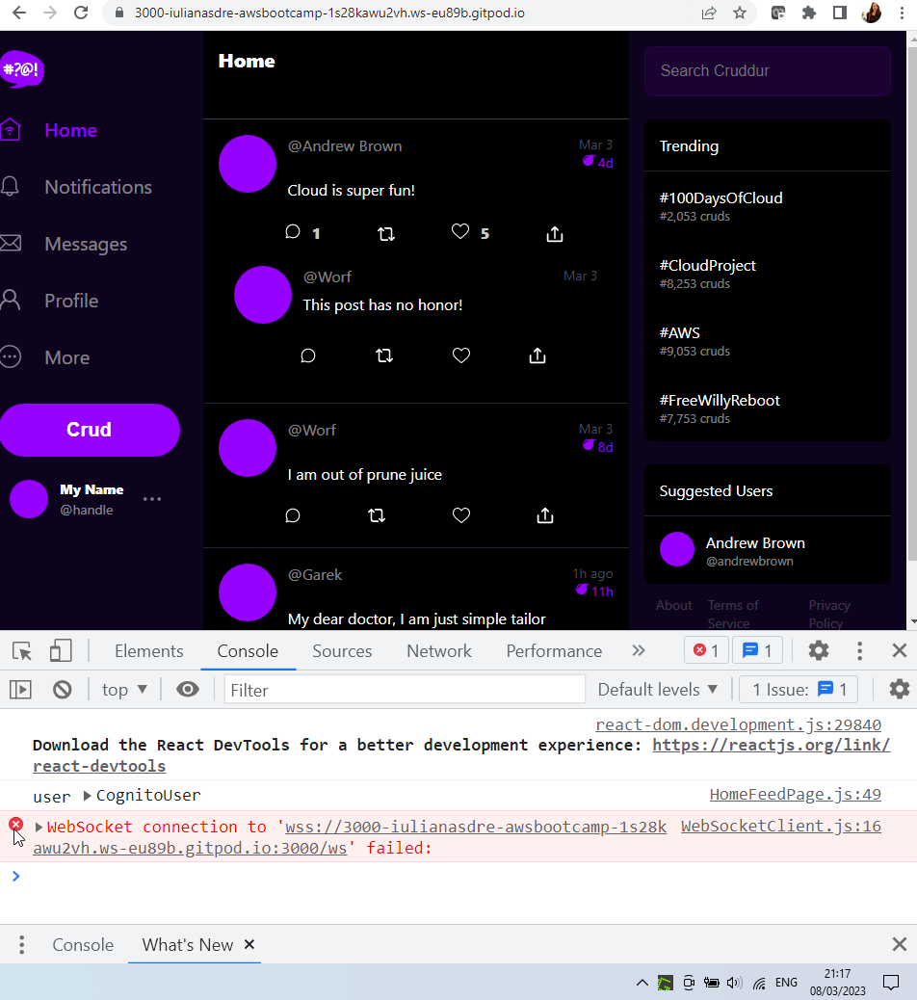
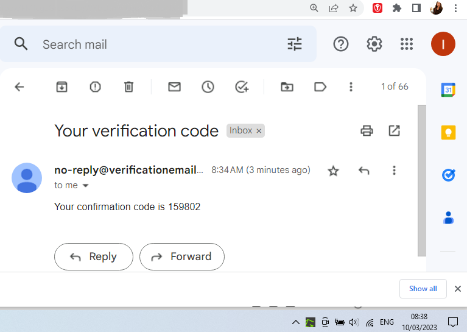
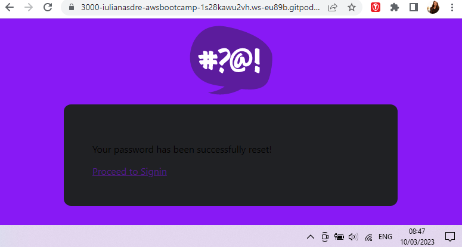
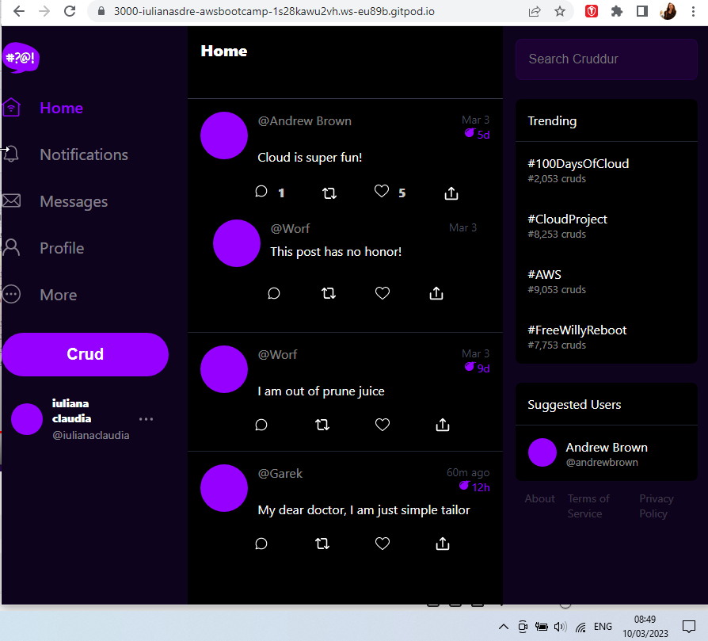

# Week 3 — Decentralized Authentication

# Required Homework

## Using Cognito and Updating Frontend Pages

- Created user pool in AWS Cognito and a user
 - User is in FORCED_PASSWORD_CHANGE and can’t be used in the code. Must get it past this status, but can’t via AWS Cognito UI - https://stackoverflow.com/questions/40287012/how-to-change-user-status-force-change-password

 ```
 aws cognito-idp admin-set-user-password \
  --user-pool-id <your-user-pool-id> \
  --username <username> \
  --password <password> \
  --permanent
 ```

**Log In**

- Now log in worked



- Added preferred_name after this

**Sign Up**

- Next error: _Username cannot be of email format, since user pool is configured for email alias._
 - [Stackoverflow advice](https://stackoverflow.com/questions/44143970/username-cannot-be-of-email-format-since-user-pool-is-configured-for-email) 
 - Needed to recreate user pool and enable only email on it (previously it had username on it as well).



**Confirmation**

- nothing to note

**Password Recovery**

- No issues getting this to work



- It was possible to sign in after, with the new password



## Resources

- Amazon SES for sending emails [https://aws.amazon.com/ses/pricing/](https://aws.amazon.com/ses/pricing/)

- To use Congnito client side, you need AWS Amplify javascript library [Amplify and js/](https://docs.amplify.aws/lib/auth/getting-started/q/platform/js/)

- Using amplify with cognito - [Amplify with Congnito](https://ui.docs.amplify.aws)
