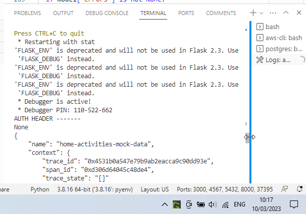
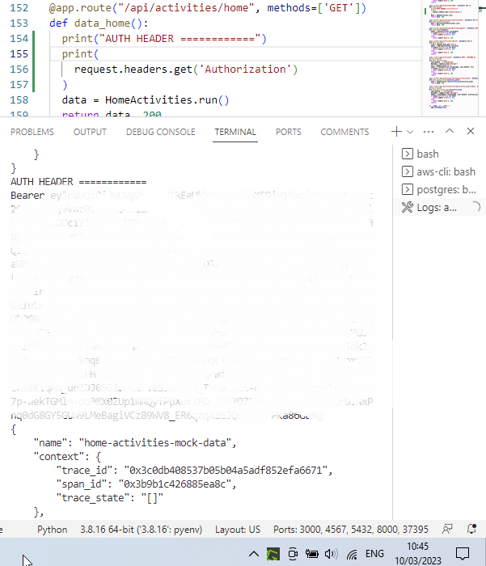
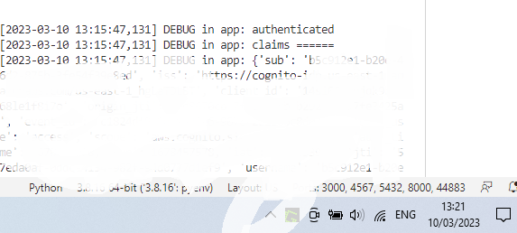
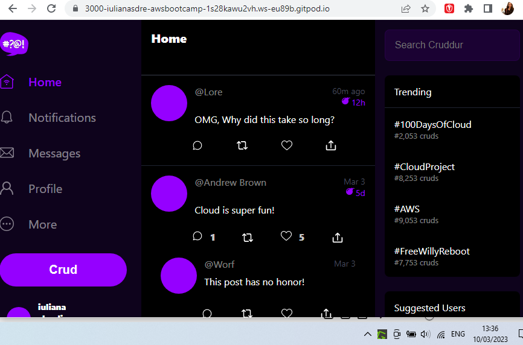
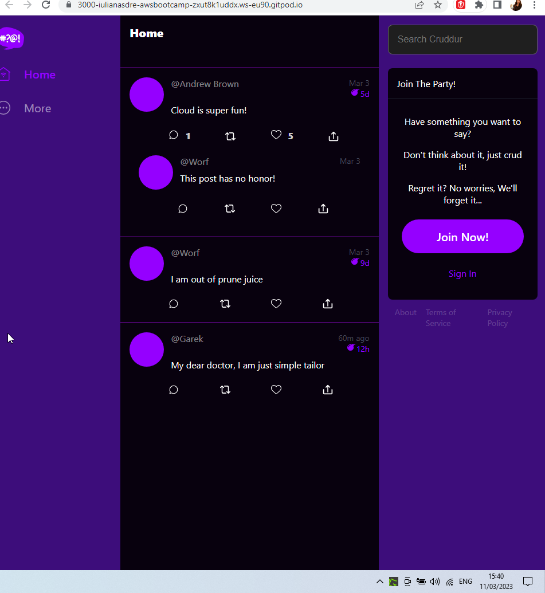

# Week 3 — Decentralized Authentication

# Required Homework

## Using Cognito and Updating Frontend Pages

- Created user pool in AWS Cognito and a user
 - User is in FORCED_PASSWORD_CHANGE and can’t be used in the code. Must get it past this status, but can’t via AWS Cognito UI - https://stackoverflow.com/questions/40287012/how-to-change-user-status-force-change-password

 ```
 aws cognito-idp admin-set-user-password \
  --user-pool-id <your-user-pool-id> \
  --username <username> \
  --password <password> \
  --permanent
 ```

**Log In**

- Now log in worked


- Added preferred_name after this

**Sign Up**

- Next error: _Username cannot be of email format, since user pool is configured for email alias._
 - [Stackoverflow advice](https://stackoverflow.com/questions/44143970/username-cannot-be-of-email-format-since-user-pool-is-configured-for-email) 
 - Needed to recreate user pool and enable only email on it (previously it had username on it as well).


**Confirmation**

- nothing to note

**Password Recovery**

- No issues getting this to work


- It was possible to sign in after, with the new password


## Cognito JWT Server side Verify

* Started with How to get http headers in flask - [https://stackoverflow.com/questions/29386995/how-to-get-http-headers-in-flask](https://stackoverflow.com/questions/29386995/how-to-get-http-headers-in-flask)
 * add a debugging print to see the header
 * I was able to see the debugging comments in the backend container logs on first attempt, using _print_, but had a new workspace and fresh docker compose up. Andrew had issues with getting the debug comments to show.
 * AUTH header was “None” in the logs as I didn’t set the Authorization header in HomeFeedPage.js. After setting that, the Bearer token was shown even with just the *print* statements.




Then we took inspiration from https://github.com/cgauge/Flask-AWSCognito 
* tried to use that library but it required a client secret and we don’t need to use that, so dropped it

Started implementing the JWT token verification from scratch using https://github.com/cgauge/Flask-AWSCognito code

* First error - solved by giving up on the class, keeping extract_access_token as a method

```
access_token = CognitoJwtToken.extract_access_token(request.headers)
TypeError: CognitoJwtToken.extract_access_token() takes 1 positional argument but 2 were given
```

* Second error - we didn’t need “token_service” in that call, solved by removing that text

```
claims = cognito_jwt_token.token_service.verify(access_token)
AttributeError: 'CognitoJwtToken' object has no attribute 'token_service'
```

* Third error - no need to use abort, so removed it from the code

```
abort(make_response(jsonify(message=str(e)), 401))
NameError: name 'abort' is not defined
```

* Fourth error - observed in backend container logs. Logged out, restarted docker-compose - it was fine then.

```
[2023-03-10 13:02:32,368] DEBUG in app: Token is expired
[2023-03-10 13:02:32,368] DEBUG in app: unauthenticated
```

* Authenticated!



* Added new content on home page when authenticated > “Lore: OMG, Why did this take so long?”



* Token is not cleared when signing out - need to unset an item in local storage in _ProfileInfo.js_. Logged out, logged in and logged out again and the token was cleared: Lore’s content was not displayed on home page anymore.

```
localStorage.removeItem("access_token")
```

## JWT implementation options

* API Gateway
* Sidecar e.g.
 * Container Sidecar pattern using AWS’s official Aws-jwt-verify.js library
 * Decouple the JWT verify process by using [Envoy](https://www.envoyproxy.io/)

## UI changes and CSS Theme

* Added CSS variables for colours - in the .css file that gets loaded first



## Security Decentralized Authentication in AWS Cloud

Notes from the video:

* SAML (Security Assertion Markup Language) gives you one access point into any app
* OpenID use your social accounts for other apps - does not do authorisation - it needs OAut
 * Decentralized concept is similar - have user+pass in one place

Basic concepts to think about:

- User Life Cycle Management
- Token Life Cycle Management and Token Scope
- AuthN
- AuthZ

## Resources

- Amazon SES for sending emails [https://aws.amazon.com/ses/pricing/](https://aws.amazon.com/ses/pricing/)

- To use Congnito client side, you need AWS Amplify javascript library [Amplify and js/](https://docs.amplify.aws/lib/auth/getting-started/q/platform/js/)

- Using amplify with cognito - [Amplify with Cognito](https://ui.docs.amplify.aws)

- Fediverse
